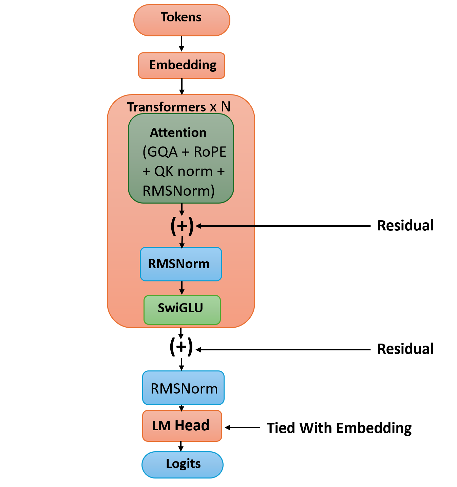
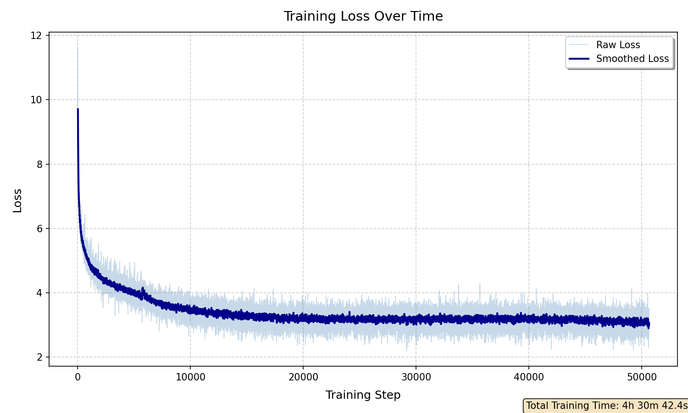
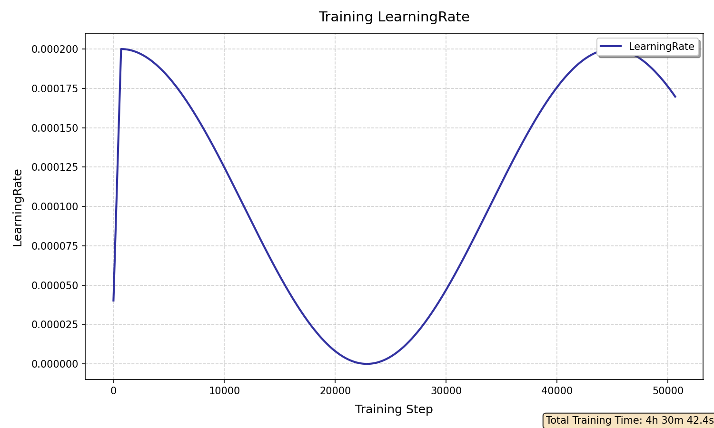

# GPT From Scratch (PyTorch)

A full implementation of a **decoder-only Transformer language model (GPT-style)** built entirely in PyTorch, focusing on modern architectural components and a clean, modular training pipeline.

This project implements a minimal but complete language modeling system including training, inference, and optimized generation with KV cache.

---

## Overview

This repository implements a GPT-style Transformer from scratch, including both the model architecture and training loop.

The goal is to provide a clear, low-level understanding of how modern LLMs are built internally, without relying on high-level frameworks or pretrained abstractions.

---

## Key Features

### Model Architecture

* Decoder-only Transformer (GPT-style)
* Grouped Query Attention (GQA)
* Rotary Position Embeddings (RoPE)
* RMSNorm (Pre-Norm architecture)
* SwiGLU feed-forward network
* Residual connections with scaling
* Weight tying between embedding and output layer

### Training System

* Custom PyTorch training loop
* Mixed precision training (AMP)
* Gradient accumulation
* Learning rate warmup + cosine decay
* Checkpoint saving and resuming
* Optional Elastic Weight Consolidation (EWC)

### Inference

* KV Cache for fast autoregressive generation
* Temperature sampling
* Top-k sampling
* Top-p (nucleus) sampling
* Repetition penalty

---

## Model Architecture

<p align="center">
  
</p>


Each Transformer block contains:

* RMSNorm
* Grouped Query Attention (with RoPE)
* SwiGLU Feed Forward Network
* Residual connections

---

## Project Structure

```text id="structure"
Model/
├── model.py              # GPT main model
├── TransformersBlock.py  # Transformer block implementation
├── attention.py          # GQA attention + KV cache logic
├── utils.py              # RoPE, RMSNorm, SwiGLU

Trainer.py               # Training loop implementation
TrainingExample.ipynb    # End-to-end training + inference example

Experiments/             # Logs and experiments
Assets/                  # Loss curves and training plots
```

---

## Training Pipeline

Training is implemented in `TrainingExample.ipynb`.

It includes:

* Dataset loading and preprocessing
* Tokenization
* Packed sequence training format
* Model initialization
* Training loop execution via `Trainer.py`
* Checkpointing and resuming training

### Optimization Details

* Optimizer: AdamW
* Scheduler: Warmup + Cosine Annealing
* Mixed precision training (fp16/bf16)
* Gradient clipping
* Optional EWC regularization

---

## Results

The model achieves stable convergence during training.

**Final Training Loss:** 2.21866

<p align="center">
  
</p>

<p align="center">
  
</p>

---

## Inference

The model supports autoregressive text generation with multiple decoding strategies.

### Features:

* KV-cache optimized decoding
* Temperature scaling
* Top-k sampling
* Top-p (nucleus) sampling
* Repetition penalty

### Example:

```python id="example1"
input_ids = tokenizer.encode("Hello", return_tensors="pt").to(device)

output = model.generate_manual(input_ids) 

print(tokenizer.decode(output[0]))
```

---

## Experiments

The `Experiments/` folder contains:

* Training logs
* Model variations
* Experimental configurations
* Observations during development

---

## Tech Stack

* PyTorch
* Python
* Hugging Face Datasets
* Hugging Face Tokenizers

---

## Notes

This is a fully custom implementation of a decoder-only Transformer model built for experimentation and deep understanding of modern language model architectures.

All components are implemented manually in PyTorch without using high-level training frameworks.

---

## License

**MIT**

